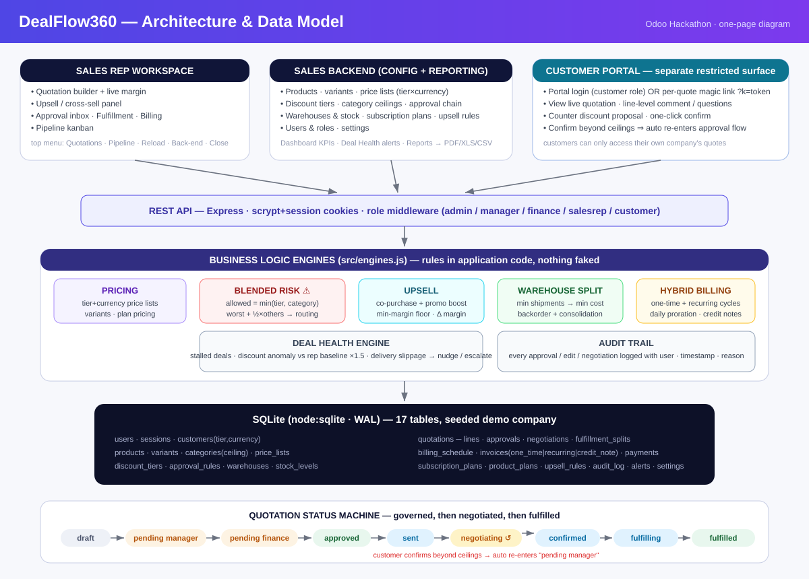

# DealFlow360 — Architecture

One page: system modules, data model, and how the major flows connect.



## System overview

```
┌──────────────────────────────────────────────────────────────────────────┐
│                            BROWSER (SPA)                                 │
│                                                                          │
│  ┌────────────────┐   ┌──────────────────────┐   ┌────────────────────┐  │
│  │ SALES WORKSPACE │   │  BACKEND (config)    │   │  CUSTOMER PORTAL   │  │
│  │ builder+cart    │   │  products·pricing·   │   │  separate surface: │  │
│  │ upsell panel    │   │  governance·warehouses│  │  quote view·line   │  │
│  │ approvals       │   │  plans·upsell rules· │   │  comments·counter  │  │
│  │ fulfillment     │   │  users·reports       │   │  discount·confirm  │  │
│  │ billing         │   │  dashboard·health    │   │  (session or magic │  │
│  └───────┬────────┘   └──────────┬───────────┘   │  link per quote)   │  │
│          │                       │               └─────────┬──────────┘  │
└──────────┼───────────────────────┼─────────────────────────┼─────────────┘
           ▼                       ▼                         ▼
══════════════════════════ REST API (Express, role-gated) ══════════════════
  /api/auth·users·customers        /api/quotations·approvals·upsell
  /api/products·price-lists        /api/split·ship·consolidate·billing·invoices
  /api/governance·warehouses       /api/portal/* (separate auth surface)
  /api/plans·upsell-rules          /api/dashboard·alerts·reports(+PDF/XLS/CSV)
           │                       │                         │
           ▼                       ▼                         ▼
┌──────────────────────────────────────────────────────────────────────────┐
│                            ENGINES (business logic)                      │
│                                                                          │
│  PRICING     tier+currency price lists, variant extras, plan pricing     │
│  RISK        per-line ceiling = min(tier, category);                     │
│              blended = worst + ½×others  → routes manager / finance      │
│  UPSELL      co-purchase score + promo boost, min-margin floor,          │
│              ranked suggestions with live margin delta                   │
│  SPLIT       greedy per line: consolidate warehouses already used,       │
│              largest availability first (fewest shipments),              │
│              tie-break on shipping cost weight; remainder → backorder    │
│  BILLING     one-time invoice at confirm; recurring first cycle +        │
│              11-cycle schedule; daily proration on qty change;           │
│              policy-based credit notes on cancellation                   │
│  HEALTH      stalled (no activity) · discount anomaly (vs rep            │
│              baseline × multiplier) · delivery slippage;                 │
│              nudge / escalate / dismiss actions                          │
└──────────────────────────────────┬───────────────────────────────────────┘
                                   ▼
                    ┌───────────────────────────────┐
                    │  SQLite (node:sqlite, WAL)    │
                    │  17 tables, seeded demo data  │
                    └───────────────────────────────┘
```

## Data model (ER summary)

```
users ──role──────────────────────► customers (tier, currency)
  │                                   │
  │ creates/owns                      │ quoted
  ▼                                   ▼
quotations ────1:N────► quotation_lines ────► products ────► categories (ceiling)
  │  status machine        │    variant_id ──► product_variants
  │  totals, margin,       │    plan_id ─────► product_plans ──► subscription_plans
  │  risk_score,           │                                      (period, proration, refund)
  │  portal_token          │
  │                        │
  ├─1:N─► approvals (level sequence: manager→finance, reason, approver)
  ├─1:N─► negotiations (comment | counter | change_request, line-level, status)
  ├─1:N─► fulfillment_splits (line × warehouse × qty, planned/shipped/backorder)
  ├─1:N─► billing_schedule (cycle dates, amount, invoiced?)   │
  └─1:N─► invoices (one_time | recurring | credit_note) ─1:N─► payments

governance config:   discount_tiers(tier→max%) · approval_rules(risk range→level)
pricing config:      price_lists(tier+currency→discount/markup)
inventory config:    warehouses(ship cost weight) · stock_levels(wh×product, reorder)
growth config:       upsell_rules(trigger→suggested, co_score, source)
ops:                 audit_log(entity,id,user,action,details,ts) · alerts(kind,status) · settings
```

## Key status machine (quotation)

```
draft ──submit──► pending_manager ──approve──► [pending_finance ──approve──►] approved
  ▲                    │ reject → rejected          │ return → returned ──(edit)──► draft
  │                    └─ return ──► returned       ▼
negotiating ◄──send── approved ──accept split──► confirmed ──ship──► fulfilling ──► fulfilled
    ▲    └── customer confirms / rep accepts counter: if risk>0 ──► pending_manager (auto re-entry)
    └── customer counter-offer (portal)
```

## Flow wiring (how modules connect)

1. **Builder** → Pricing engine prices each line (tier list × variants × plans); Risk engine recomputes blended score on every edit; Upsell engine ranks candidates not in cart.
2. **Submit** → Risk engine routes (none / manager / manager+finance) and creates the approval chain; audit logged.
3. **Approve** → step escalation; on final approval the order becomes plannable.
4. **Fulfillment** → Split engine proposes allocation across live stock; accepting confirms the order; Shipping decrements stock; restock enables backorder consolidation.
5. **Billing** → confirm generates one-time + first-cycle invoices and the recurring schedule; proration/credit-note engine handles mid-cycle changes; payments close invoices.
6. **Portal** → customer comments/counters/confirm; any terms beyond ceilings push the quote back into the approval chain automatically.
7. **Health & Reports** → health engine materializes alerts from activity, rep baselines and delivery promises; report engine aggregates with period/rep/approval/product filters and exports CSV/XLS/PDF (generated in-process, no dependencies).
